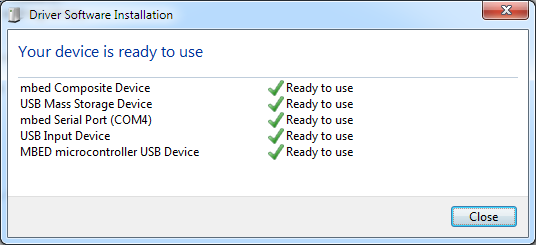

## The Firmware for OSHChip_CMSIS_DAP

The Firmware is described here <a href="https://developer.mbed.org/handbook/cmsis-dap-interface-firmware" target="_blank">mbed HDK Firmware</a>

The firmware described can be used with several different microprocessors
which can be seen here <a href="https://github.com/mbedmicro/CMSIS-DAP/tree/master/interface/mdk" target="_blank">Microprocessors</a>

OSHChip_CMSIS_DAP V1.0 uses the NXP LPC11U35 microprocessor.
The above firmware is quite dated and does not describe the nRF51822 target CPU
that is used in OSHChip V1.0. A branch of this firmware with support
for nRF51822 has been developed by Yihui Xiong of Seeed Studio.
This version of the firmware is also used by OSHChip_CMSIS_DAP V1.0.

It is here: <a href="https://github.com/xiongyihui/CMSIS-DAP" target="_blank">Firmware Supporting nRF51822</a>

For OSHChip_CMSIS_DAP, only very minor cosmetic changes were made to the firmware to acknowledge its origin.

There are two versions, that differ only in the default drive name that shows up in your operating system's file explorer

### The Firmware files

* **lpc11u35_nrf51822_if_reports_OSHChip_1.0.bin**  
  Md5Sum: 4e8e75e39c4df5c8d747cf7bd3480122   
  This is the default firmware that OSHChip_CMSIS_DAP is shipped with.
  When OSHChip_CMSIS_DAP is connected to your computer, it will show up
  in the list of drives as "OSHChip 1.0"
* **lpc11u35_nrf51822_if_reports_MBED.bin**  
  Md5Sum: 54e64e75ae196dfe09e5174d22e201d4  
  This is the alternative firmware that you can load into OSHChip_CMSIS_DAP
  With this firmware, when OSHChip_CMSIS_DAP is connected to your computer,
  it will show up in the list of drives as "MBED"

### How to install the Firmware

This procedure is only needed if you want to change from the default
firmware that is pre-installed in your OSHChip_CMSIS_DAP_V1.0 programmer/debugger.
This could be because you want it to show up as "MBED" or because an update
to the firmware is available.

1. Hold the reset button while connecting the USB cable
2. Should show up as a drive with the name "CRP DISABLD" (yes, missing an E)
3. Go to that drive and delete the firmware.bin file
4. Drag and drop (or copy) one of the above two .bin files to the CRP DISABLD drive.
5. Disconnect USB cable, wait a second, and re-connect without holding the reset button.
6. If this is the first time this is being done, then drivers must be installed, and
   can take a few minutes while your operating systen retrieves them. In Windows, the
   driver install pop-up should show something like this: 
7. When complete, it will show up as
  * A drive named "OSHChip 1.0" or "MBED" (depending on the firmware file you loaded)
  * In the device manager (Windows), under the heading:
    * "Universal Serial Bus controllers":  "mbed Composite Device"
    * "Ports (COM & LPT)":  "mbed Serial Port (COMxxx)"
    * "Portable Devices":   "OSHChip 1.0"
    * "Human Interface Devices":  
      It adds two devices, but the names do not make it  
      obvious that they are related to the CMSIS-DAP board:
      * "HID-compliant Device"
      * "USB Input Device"

### Serial port driver for Windows

*Only for Windows*

After connecting an OSHChip_CMSIS_DAP_V1.0 to your computer for the first time,
and the automatic driver process has completed, an additional driver needs to be
installed. [mbed serial driver installation](https://developer.mbed.org/handbook/Windows-serial-configuration)  
(this needs to be done regardless of which of the two firmware images you have installed)

